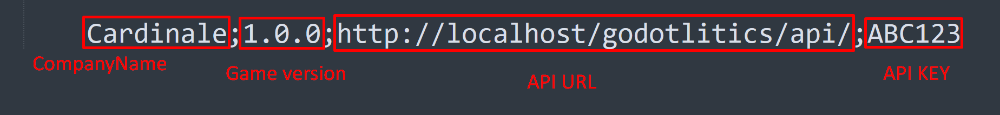

# godotlitics

## About
Godotlitics is an open source analytics tool for your Godot games.

## Features
- Track events inside Godot game (Game launched, Ad showed, Error detected, Progression, Page viewed).
- Web Dashboard
- Graphs
- REST API
- Free and Open source

## How to install Godotlitics?
- Copy "Web Dashboard" folder files to your web server (or local Wamp installation)
- Import SQL file in your database
- Modify api/Helper.php file to define your credentials
- Copy "Godot Scripts" folder content inside your Godot project
- In Godot, go to "Project/Project settings" in "General" tab, "Application/Configuration" menu and edit game description to set this configuration string with your own settings :

CompanyName;1.0.0;http://localhost/godotlitics/api/;ABC123

Company_Name;Game_Version;API_URL;API_KEY

- Look at Example.cs script to understant how to use Godotlitics functions

Video tutorial (french): [https://youtu.be/2rJVWN9iwZg](https://youtu.be/2rJVWN9iwZg)
